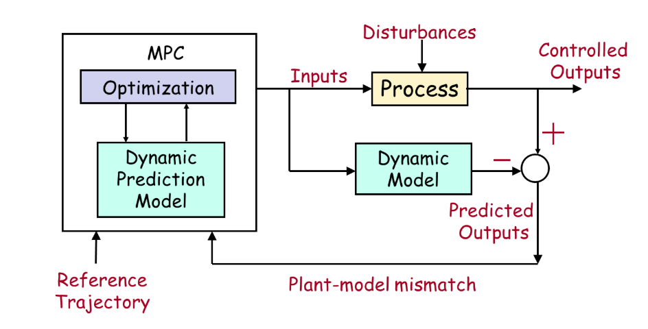

# Foundations of Linear Model Predictive Control
A Foundation Course on Model Predictive Control (MPC) developed using basic toolboxes in MATLAB

*Created with MATLAB R2024a.* 

*Compatible with MATLAB R2024a and later releases.*

 © Prof. Sachin Patwardhan ([Indian Institute of Technology, Bombay, Faculty of Chemical Engineering](https://www.che.iitb.ac.in/old/faculty/sachin-c-patwardhan))
# Introduction
This course covers the design, analysis, and implementation of Model Predictive Control (MPC) for MIMO dynamic systems. Starting from discrete-time linear perturbation models, it develops the theoretical foundations of MPC — including its reformulation as a quadratic programming problem, connections to Linear Quadratic Optimal Control, and nominal stability via Lyapunov's method. 

  

  <em>MPC Schematic</em>

Topics include linearization of nonlinear mechanistic models, system identification, state estimation via Kalman filtering, and offset-free control under model-plant mismatch. A concluding excursion connects MPC with Reinforcement Learning. The Quadruple Tank Process serves as a unifying simulation example throughout, with course materials delivered via MATLAB Live Scripts and Simulink.

# About the Course
## Who can take this course?
 This course is intended for graduate students in engineering and industrial automation practitioners seeking exposure to advanced multivariable control concepts. Senior undergraduate students can also take this course if they are interested in systems and control. It is assumed that the learner has studied the first undergraduate control systems course taught in any engineering department. Background in linear algebra, linear ordinary differential equations, and, to some extent, optimization will help navigate the course. No specific background of any engineering discipline is assumed. 
## Course Application Areas
Process Control (Chemical and Metallurgical Engineering), Robotics (Mechanical Engineering), Aeronautical Engineering, Systems and Control Engineering, Electrical Engineering
## Pre-requisite Knowledge
 **Linear Algebra:** Matrix algebra, positive definite and semi-definite matrices, eigenvalues, and eigen-vectors.
 
 **Optimization:** Familiarity with basic concepts of optimization (necessary and sufficient conditions for unconstrained and constrained optimization), quadratic programming
 
 **Fundamentals of Feedback Control Systems:** Familiarity with classical control methods (transfer function representation of dynamic models, stability analysis of SISO systems, PID controller design) and the concept of feed-forward and feedback control
 
 **Fundamentals of Digital Control:** Sampling, quantization, Analog-to-Digital Converters (ADCs), Digital-to-Analog Converters (DACs)
## MATLAB and Simulink Toolboxes Required
Control System Toolbox

Simulink Control Design

Optimization Toolbox

Statistics Toolbox 

System Identification Toolbox

Reinforcement Learning Toolbox
## Suggested MATLAB/Simulink Background Courses for beginners 
* [MATLAB Onramp](https://matlabacademy.mathworks.com/details/matlab-onramp/gettingstarted)
  -Learn the essentials of MATLAB through this free, two-hour introductory tutorial on commonly used features and workflows.
* [Simulink Onramp](https://matlabacademy.mathworks.com/details/simulink-onramp/simulink)
  -Learn the basics of how to create, edit, and simulate models in Simulink®. Use block diagrams to represent real-world systems and simulate components and algorithms.
## Course Objectives
The overall objective of this course is to introduce the design, analysis, and implementation of multivariable discrete-time state-feedback optimal controllers for managing a system's transient behavior. Learning objectives can be summarized as follows:
1. **Model Development:** 
Develop computer control relevant linear dynamic models, either from mechanistic dynamic models or from operating transient data
2. **Controller Design:** 
Design state estimators (model-based estimators of unmeasured variables) and multivariable state feedback controllers (Linear Quadratic Optimal Controller or LQOC, and Model Predictive Control or MPC) using the control-relevant models
3. **System Analysis:** 
Analyze the dynamic behavior of the open-loop system using controllability, observability, and the open-loop or  controlled system using  Lyapunov’s first and second methods 
4. **Performance Evaluation:** 
Simulate the closed-loop system behavior of the benchmark Quadruple Tank system using the designed state estimators and multi-variable state feedback controllers 
## Learning Outcomes
Students will be able to
1. Understand the different aspects of computer-based control
2. Understand fundamental concepts of state feedback control and MPC
3. Synthesize and implement MPC control strategies using mechanistic, gray-box, and black-box dynamic models and basic MATLAB toolboxes such as Control Systems, Statistics, Optimization, and System Identification
4. Analyze the advantages of MPC over traditional control methods
5. Apply MPC techniques to solve various industrial and other real-world problems.
# Instructions
The course content can be approached in one of two ways:

1. Click on https://matlab.mathworks.com/open/github/v1?repo=SachinMPC/MATLAB-MPC-Foundation-Course. This will allow you to access the content online in your web browser through MATLAB Online.
2. Download all files and access the content from the MATLAB desktop application.
# Course Contents
This course is organized into 9 Modules.
## Module 1. Introduction to Model Predictive Control 
This module provides an overview of the course and introduces the theme example used in the course: the Quadruple Tank System. 
1. Lesson 1: Introduction to Advanced Control
2. Lesson 2: Dynamic Models and Quadruple Tank Process 
## Module 2: Fundamentals of Moving Horizon Control
This module begins with a nonlinear mechanistic model-based optimal control formulation, and, using concepts of linearization and discretization, proceeds to introduce discrete linear model-based feed-forward MPC formulations under the perfect model assumption and perfect state measurement 
1. Lesson 1:  Moving Horizon Optimal Control
2. Lesson 2: Local Linearization of a Nonlinear Dynamical Model
3. Lesson 3: Discretization of Linear Models
4. Lesson 4: Dynamic Simulation of Linearized Model
5. Lesson 5: Reformulation of MPC using Linear Model
## Module 3: Quadratic Optimal Control and Stability Analysis
This module introduces classical quadratic optimal control (LQOC) theory and connects it with MPC. This module discusses the nominal stability analysis of unconstrained and constrained MPC. 
1. Lesson 1: Linear Quadratic Optimal Controller: Formulation
2. Lesson 2: Stability Analysis of Discrete Linear Systems
## Module 4: Output Feedback and Servo Control 
This module presents different variants of MPC by relaxing the assumption of a perfect model. MPC variants that address model-plant mismatch, setpoint (reference signal) tracking, and output feedback are introduced using the concept of target setting. 
1. Lesson 1: From LQOC to Quasi-Infinite Horizon MPC
2. Lesson 2: MPC Target Tracking for Linear Process
3. Lesson 3: Reference Tracking and Disturbance Rejection using MPC: Quadruple Tank Case Study
4. Lesson 4: Vanilla_MPC_Variants
5. Lesson 5: Summary of Vanilla Linear MPC
## Module 5: State Estimator Design for MPC
This module introduces the basics of state estimation. This includes the design of Luenberger observers using the pole-placement method and Kalman filtering, which provide optimal state estimates in the presence of stochastic disturbances and measurement noise. 
1. Lesson 1: Introduction to State Estimation
2. Lesson 2: Luenberger (Pole Placement) Observer Design
3. Lesson 3: Stochastic Disturbances and Kalman Filtering
4. Lesson 4: Stationary Kalman Filter and Drifting Disturbance Estimation
## Module 6: MPC using State Estimators
This module introduces the implementation of LQOC and MPC using state estimators. 
1. Lesson 1: LQR Using State Estimator 
2. Lesson 2: Offset Free LQOC Using State Estimator
3. Lesson 3: Offset-free State Space MPC using Innovation Bias Approach 
4. Lesson 4: Output Tracking MPC using Innovation Bias Approach
## Module 7: Identification of Black-box Models from Data 
This module introduces the fundamentals of grey-box and black-box model identification, starting from experimental data obtained by perturbing the system under consideration. 
1. Lesson 1: Introduction to System Identification
2. Lesson 2: Output Error State Space Models
3. Lesson 3: Innovation Form of State Space Models
## Module 8: MPC using Black-box Models
In this module, we present offset-free state feedback control using estimators derived from models directly identified from experimental data. 
1. Lesson 1: State Feedback Control Using State Estimator: Black Box Models
2. Lesson 2: Black-box Model based MPC using Innovation Bias Approach
## Module 9: Connections between MPC and Reinforcement Learning - A brief excursion
This module introduces the fundamentals of Reinforcement Learning (RL) and the use of Bellman’s principle for solving RL-based optimization problems. It provides a comparative overview of Model Predictive Control (MPC) and RL approaches, followed by the implementation of an RL-based controller for the Q-Tank process. The module emphasizes both theoretical insights and practical performance evaluation of the RL controller.
1. Lesson 1: MPC and Reinforcement Learning (RL)
2. Lesson 2: Bellman's Principle and RL
3. Lesson 3: DDPG and Actor Critic Network
4. Lesson 4: RL: Q Tank Example
